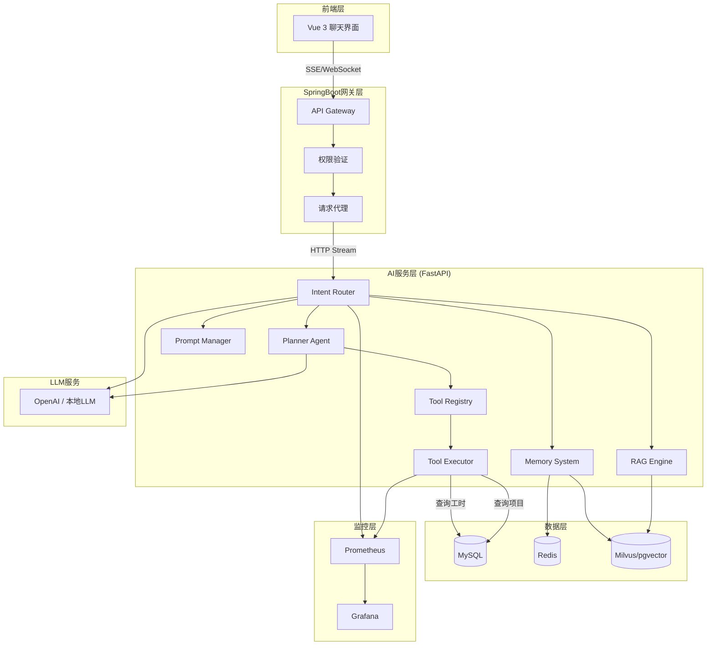
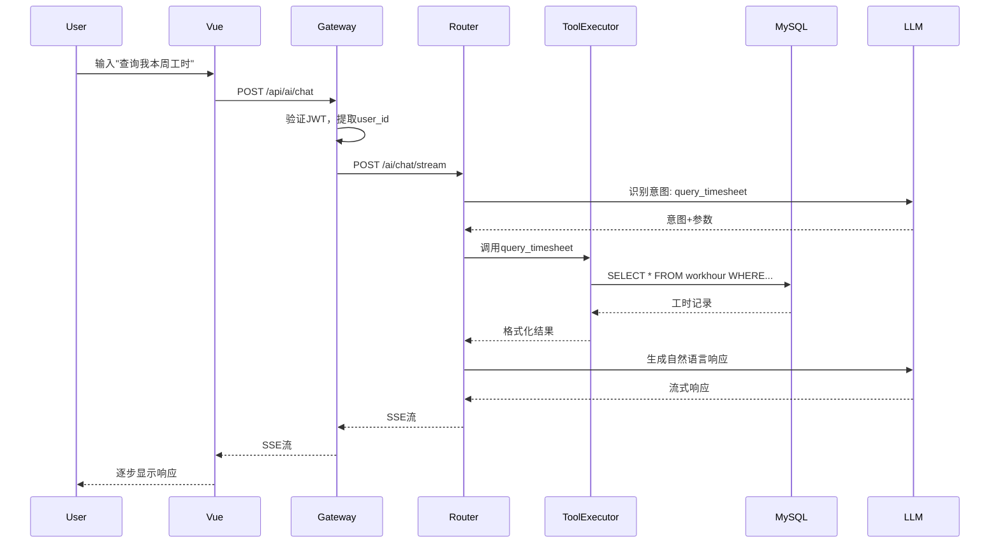
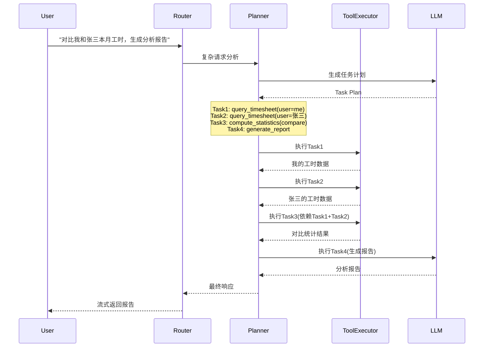
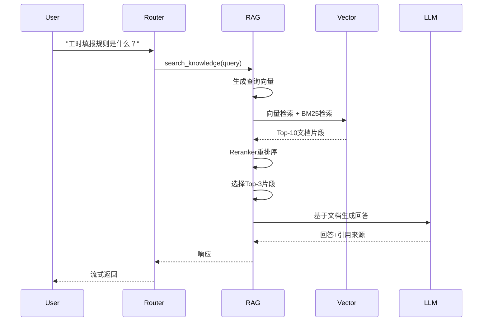

# AI智能助手技术设计文档

## 概述

本文档定义了为现有工时管理系统（SpringBoot 3 + Vue 3 + MySQL）添加AI智能助手功能的技术设计。该系统采用三层架构，通过自然语言交互方式为用户提供工时查询、统计分析、周报生成、风险评估等智能化服务。

### 设计目标

- **智能交互**: 通过自然语言理解用户意图，提供流畅的对话体验
- **权限安全**: 严格遵守现有权限体系，确保数据访问安全
- **可扩展性**: 采用工具注册机制，支持快速扩展新功能
- **高性能**: 支持流式响应和并发处理，提供良好的用户体验
- **可观测性**: 完善的监控和日志体系，便于运维和问题排查

### 技术栈选型

**前端层 (Vue 3)**
- Vue 3 + TypeScript: 聊天界面组件
- Pinia: 状态管理
- Axios + EventSource: HTTP请求和SSE流式响应
- Markdown-it: Markdown渲染

**网关层 (SpringBoot 3)**
- Spring Boot 3.x: API网关
- Spring WebFlux: 流式响应支持
- WebClient: 异步HTTP客户端
- Spring Security: 权限验证

**AI服务层 (FastAPI)**
- FastAPI: 高性能异步Web框架
- LangChain/LangGraph: Agent框架和工具编排
- Pydantic: 数据验证和JSON Schema
- OpenAI SDK / 本地LLM: 大语言模型接口

**基础设施**
- Redis: 会话缓存和短期记忆
- Milvus/pgvector: 向量数据库（知识库和长期记忆）
- MySQL: 业务数据存储
- Prometheus + Grafana: 监控和可视化

## 架构设计

### 系统架构图



### 三层架构说明

**前端层 (Presentation Layer)**
- 职责: 提供聊天界面，处理用户输入，渲染AI响应
- 技术: Vue 3组件，支持Markdown渲染和流式显示
- 通信: 通过SSE接收流式响应，通过HTTP POST发送消息

**网关层 (Gateway Layer)**
- 职责: 统一入口，权限验证，请求路由，流式代理
- 技术: SpringBoot 3 + WebFlux
- 功能: JWT验证，用户身份提取，请求转发，响应流转发

**AI服务层 (AI Service Layer)**
- 职责: 意图识别，任务规划，工具调用，知识检索，响应生成
- 技术: FastAPI + LangChain
- 组件: Intent Router, Planner Agent, Tool Executor, RAG Engine, Memory System

### 数据流设计

#### 简单查询流程



#### 复杂查询流程（需要Planner）



#### RAG知识库查询流程



## 组件和接口

### 前端组件 (Vue 3)

#### ChatWindow.vue
聊天窗口主组件

**Props:**
- `visible`: boolean - 窗口显示状态
- `position`: string - 窗口位置 (bottom-right, bottom-left)

**State:**
```typescript
interface ChatState {
  messages: Message[]
  inputText: string
  isTyping: boolean
  sessionId: string
}

interface Message {
  id: string
  role: 'user' | 'assistant'
  content: string
  timestamp: Date
  isStreaming?: boolean
}
```

**Methods:**
- `sendMessage(text: string)`: 发送用户消息
- `handleStream(chunk: string)`: 处理流式响应片段
- `clearHistory()`: 清除对话历史

#### MessageList.vue
消息列表组件

**Props:**
- `messages`: Message[] - 消息列表

**Features:**
- Markdown渲染
- 代码高亮
- 自动滚动到底部
- 流式显示动画

#### InputBox.vue
输入框组件

**Props:**
- `disabled`: boolean - 是否禁用
- `placeholder`: string - 占位文本

**Events:**
- `@send`: 发送消息事件

### SpringBoot网关层接口

#### AI Chat API

**POST /api/ai/chat**

请求体:
```json
{
  "message": "查询我本周工时",
  "sessionId": "uuid-v4",
  "stream": true
}
```

响应 (SSE流):
```
data: {"type": "start", "messageId": "msg-123"}

data: {"type": "chunk", "content": "您本周"}

data: {"type": "chunk", "content": "的工时"}

data: {"type": "end", "messageId": "msg-123"}
```

错误响应:
```json
{
  "error": "AI_SERVICE_UNAVAILABLE",
  "message": "AI服务暂时不可用，请稍后重试",
  "timestamp": "2024-01-15T10:30:00Z"
}
```

**GET /api/ai/tools**

获取可用工具列表

响应:
```json
{
  "tools": [
    {
      "name": "query_timesheet",
      "description": "查询工时记录",
      "category": "data_query"
    }
  ]
}
```

**POST /api/ai/tools/register**

动态注册新工具（管理员权限）

请求体:
```json
{
  "name": "custom_tool",
  "description": "自定义工具",
  "jsonSchema": {...},
  "endpoint": "http://service/api/tool"
}
```

**GET /api/ai/health**

健康检查

响应:
```json
{
  "status": "healthy",
  "aiService": "connected",
  "latency": 45
}
```

### AI服务层接口 (FastAPI)

#### POST /ai/chat/stream

处理聊天请求并返回流式响应

请求体:
```json
{
  "message": "查询我本周工时",
  "userId": "user-123",
  "sessionId": "session-456",
  "context": {
    "entityType": "EMPLOYEE",
    "departmentId": "dept-001"
  }
}
```

响应 (SSE流):
```
data: {"type": "thinking", "content": "正在分析您的请求..."}

data: {"type": "tool_call", "tool": "query_timesheet", "params": {...}}

data: {"type": "tool_result", "result": {...}}

data: {"type": "response", "content": "您本周共填报工时40小时..."}

data: {"type": "done"}
```

#### POST /ai/plan

生成任务执行计划（Planner Agent）

请求体:
```json
{
  "request": "对比我和张三本月工时",
  "userId": "user-123",
  "availableTools": ["query_timesheet", "compute_statistics"]
}
```

响应:
```json
{
  "planId": "plan-789",
  "tasks": [
    {
      "taskId": "task-1",
      "toolName": "query_timesheet",
      "parameters": {"userId": "user-123", "dateRange": "2024-01"},
      "dependencies": []
    },
    {
      "taskId": "task-2",
      "toolName": "query_timesheet",
      "parameters": {"userId": "user-456", "dateRange": "2024-01"},
      "dependencies": []
    },
    {
      "taskId": "task-3",
      "toolName": "compute_statistics",
      "parameters": {"type": "compare", "data": ["task-1", "task-2"]},
      "dependencies": ["task-1", "task-2"]
    }
  ]
}
```

#### POST /ai/execute

执行任务计划

请求体:
```json
{
  "planId": "plan-789",
  "userId": "user-123"
}
```

响应 (流式):
```json
{
  "taskId": "task-1",
  "status": "completed",
  "result": {...}
}
```

#### GET /ai/tools

获取已注册工具列表

响应:
```json
{
  "tools": [
    {
      "name": "query_timesheet",
      "description": "查询工时记录",
      "jsonSchema": {
        "type": "object",
        "properties": {
          "userId": {"type": "string"},
          "dateRange": {"type": "string"}
        },
        "required": ["userId"]
      },
      "category": "data_query"
    }
  ]
}
```

#### POST /ai/tools/register

注册新工具

请求体:
```json
{
  "name": "custom_analysis",
  "description": "自定义分析工具",
  "jsonSchema": {...},
  "handler": "module.function_name"
}
```

### 工具接口定义

所有工具遵循统一的接口规范：

```python
from typing import Dict, Any
from pydantic import BaseModel

class ToolDefinition(BaseModel):
    name: str
    description: str
    json_schema: Dict[str, Any]
    category: str
    
class ToolResult(BaseModel):
    success: bool
    data: Any
    error: Optional[str] = None
    executionTime: float

async def tool_handler(params: Dict[str, Any], context: Dict[str, Any]) -> ToolResult:
    """
    工具处理函数标准接口
    
    Args:
        params: 工具参数（已通过JSON Schema验证）
        context: 执行上下文（包含userId, permissions等）
    
    Returns:
        ToolResult: 执行结果
    """
    pass
```

## 数据模型

### 会话管理模型

#### Session (Redis)
```python
class Session(BaseModel):
    session_id: str
    user_id: str
    created_at: datetime
    updated_at: datetime
    expires_at: datetime
    conversation_history: List[Message]  # 最近5轮对话
    
class Message(BaseModel):
    message_id: str
    role: Literal["user", "assistant", "system"]
    content: str
    timestamp: datetime
    metadata: Optional[Dict[str, Any]] = None
```

Redis存储结构:
```
Key: session:{session_id}
Value: JSON序列化的Session对象
TTL: 1800秒 (30分钟)
```

### 工具注册模型

#### Tool (内存 + 持久化)
```python
class ToolParameter(BaseModel):
    name: str
    type: str  # string, number, boolean, object, array
    description: str
    required: bool
    default: Optional[Any] = None
    enum: Optional[List[Any]] = None

class Tool(BaseModel):
    name: str
    description: str
    category: str  # data_query, statistics, report, knowledge
    json_schema: Dict[str, Any]
    handler: str  # 处理函数路径
    timeout: int = 30  # 超时时间（秒）
    requires_permission: bool = True
    created_at: datetime
    updated_at: datetime
```

### 任务计划模型

#### TaskPlan
```python
class TaskNode(BaseModel):
    task_id: str
    tool_name: str
    parameters: Dict[str, Any]
    dependencies: List[str]  # 依赖的task_id列表
    status: Literal["pending", "running", "completed", "failed"]
    result: Optional[Any] = None
    error: Optional[str] = None
    execution_time: Optional[float] = None

class TaskPlan(BaseModel):
    plan_id: str
    user_id: str
    original_request: str
    tasks: List[TaskNode]
    created_at: datetime
    status: Literal["pending", "executing", "completed", "failed"]
```

### 记忆系统模型

#### ShortTermMemory (Redis)
```python
class ConversationContext(BaseModel):
    session_id: str
    user_id: str
    recent_messages: List[Message]  # 最近5轮
    current_topic: Optional[str] = None
    mentioned_entities: Dict[str, List[str]]  # {"projects": ["项目A"], "users": ["张三"]}
```

#### LongTermMemory (Vector Database)
```python
class UserMemory(BaseModel):
    memory_id: str
    user_id: str
    memory_type: Literal["preference", "interaction", "fact"]
    content: str
    embedding: List[float]  # 向量表示
    metadata: Dict[str, Any]
    created_at: datetime
    access_count: int
    last_accessed: datetime

# 示例
{
    "memory_id": "mem-123",
    "user_id": "user-456",
    "memory_type": "preference",
    "content": "用户经常查询项目A的工时数据",
    "metadata": {
        "project_id": "proj-A",
        "query_count": 15,
        "date_range_preference": "last_week"
    }
}
```

### 知识库模型

#### Document (Vector Database)
```python
class DocumentChunk(BaseModel):
    chunk_id: str
    document_id: str
    content: str
    embedding: List[float]
    metadata: DocumentMetadata
    
class DocumentMetadata(BaseModel):
    title: str
    source: str  # 文档来源
    category: str  # 制度、流程、FAQ等
    page_number: Optional[int] = None
    created_at: datetime
    updated_at: datetime
```

### 审计日志模型

#### AuditLog (MySQL)
```sql
CREATE TABLE ai_audit_log (
    id BIGINT PRIMARY KEY AUTO_INCREMENT,
    trace_id VARCHAR(64) NOT NULL,
    user_id VARCHAR(64) NOT NULL,
    session_id VARCHAR(64),
    request_type VARCHAR(32) NOT NULL,  -- chat, tool_call, plan
    request_content TEXT,
    intent_type VARCHAR(64),
    tool_calls JSON,  -- [{"tool": "query_timesheet", "params": {...}, "result": {...}}]
    response_content TEXT,
    execution_time_ms INT,
    status VARCHAR(16),  -- success, error
    error_message TEXT,
    created_at TIMESTAMP DEFAULT CURRENT_TIMESTAMP,
    INDEX idx_user_id (user_id),
    INDEX idx_trace_id (trace_id),
    INDEX idx_created_at (created_at)
);
```

### 监控指标模型

#### Metrics (Prometheus)
```python
# Counter: 累计计数
ai_requests_total{user_id, intent_type, status}
ai_tool_calls_total{tool_name, status}

# Histogram: 分布统计
ai_request_duration_seconds{intent_type}
ai_tool_execution_duration_seconds{tool_name}
ai_llm_token_usage{model, type}  # type: prompt/completion

# Gauge: 瞬时值
ai_active_sessions
ai_cache_hit_rate
```

### 权限上下文模型

#### PermissionContext
```python
class PermissionContext(BaseModel):
    user_id: str
    entity_type: str  # EMPLOYEE, DEPT_ADMIN, SUPER_ADMIN, PROJECT_MANAGER
    department_id: Optional[str] = None
    managed_projects: List[str] = []  # 管理的项目ID列表
    
    def can_access_user_data(self, target_user_id: str) -> bool:
        """判断是否有权限访问目标用户数据"""
        if self.entity_type == "SUPER_ADMIN":
            return True
        if self.entity_type == "EMPLOYEE":
            return self.user_id == target_user_id
        if self.entity_type == "DEPT_ADMIN":
            # 需要查询target_user是否在同一部门
            return self._is_same_department(target_user_id)
        return False
```

### Prompt模板模型

#### PromptTemplate (YAML文件)
```yaml
# prompts/system_prompt.yaml
version: "1.0"
template: |
  你是一个工时管理系统的AI助手。你的职责是帮助用户查询工时、生成报告、回答问题。
  
  当前用户信息：
  - 用户ID: {{user_id}}
  - 角色: {{entity_type}}
  - 部门: {{department_id}}
  
  可用工具：
  {{tools_description}}
  
  请遵循以下规则：
  1. 严格遵守权限限制，不要访问用户无权查看的数据
  2. 当需要调用工具时，使用JSON格式返回工具调用请求
  3. 对于复杂请求，先分解为多个步骤
  4. 始终以友好、专业的语气回复

variables:
  - user_id
  - entity_type
  - department_id
  - tools_description
```


## 核心算法和流程

### Intent Router算法

Intent Router负责识别用户意图并路由到相应的处理模块。

```python
async def route_intent(message: str, context: PermissionContext) -> IntentResult:
    """
    意图识别和路由算法
    
    流程:
    1. 使用LLM分析用户消息，识别意图类型
    2. 提取关键参数（时间范围、用户名、项目名等）
    3. 根据意图类型选择处理路径
    4. 返回路由决策
    """
    
    # Step 1: 构建意图识别Prompt
    prompt = build_intent_prompt(message, available_intents)
    
    # Step 2: 调用LLM识别意图
    llm_response = await llm_service.complete(prompt)
    intent_data = parse_intent_response(llm_response)
    
    # Step 3: 验证意图和参数
    if not validate_intent(intent_data):
        return IntentResult(
            intent_type="clarification",
            message="请提供更多信息"
        )
    
    # Step 4: 路由决策
    if intent_data.type == "knowledge_qa":
        return IntentResult(
            intent_type="knowledge_qa",
            handler="rag_engine",
            params={"query": message}
        )
    elif intent_data.type in ["query_timesheet", "query_project", "statistics"]:
        return IntentResult(
            intent_type="tool_execution",
            handler="tool_executor",
            tool_name=intent_data.type,
            params=intent_data.params
        )
    elif intent_data.type == "complex_request":
        return IntentResult(
            intent_type="planning",
            handler="planner_agent",
            params={"request": message}
        )
    else:
        return IntentResult(
            intent_type="general_chat",
            handler="llm_service"
        )
```

### Planner Agent算法

Planner Agent使用ReAct框架将复杂请求分解为多个子任务。

```python
async def plan_tasks(request: str, available_tools: List[Tool]) -> TaskPlan:
    """
    任务规划算法
    
    使用ReAct (Reasoning + Acting) 框架:
    1. Thought: 分析请求，识别需要哪些信息
    2. Action: 确定需要调用哪些工具
    3. Observation: 预测工具返回的数据类型
    4. 重复直到完成规划
    """
    
    # Step 1: 构建规划Prompt
    planning_prompt = f"""
    用户请求: {request}
    
    可用工具:
    {format_tools(available_tools)}
    
    请分析这个请求，将其分解为多个子任务。对于每个子任务：
    1. 确定需要调用的工具
    2. 确定工具参数
    3. 确定任务依赖关系
    
    以JSON格式返回任务计划。
    """
    
    # Step 2: LLM生成任务计划
    llm_response = await llm_service.complete(planning_prompt)
    raw_plan = parse_json_response(llm_response)
    
    # Step 3: 构建任务依赖图
    tasks = []
    for i, task_def in enumerate(raw_plan["tasks"]):
        task = TaskNode(
            task_id=f"task-{i+1}",
            tool_name=task_def["tool"],
            parameters=task_def["params"],
            dependencies=task_def.get("dependencies", []),
            status="pending"
        )
        tasks.append(task)
    
    # Step 4: 验证依赖关系（检测循环依赖）
    if has_circular_dependency(tasks):
        raise ValueError("检测到循环依赖")
    
    # Step 5: 拓扑排序确定执行顺序
    execution_order = topological_sort(tasks)
    
    return TaskPlan(
        plan_id=generate_uuid(),
        user_id=context.user_id,
        original_request=request,
        tasks=tasks,
        status="pending"
    )

def topological_sort(tasks: List[TaskNode]) -> List[str]:
    """
    拓扑排序算法，确定任务执行顺序
    """
    # 构建邻接表和入度表
    graph = defaultdict(list)
    in_degree = defaultdict(int)
    
    for task in tasks:
        for dep in task.dependencies:
            graph[dep].append(task.task_id)
            in_degree[task.task_id] += 1
    
    # BFS拓扑排序
    queue = deque([t.task_id for t in tasks if in_degree[t.task_id] == 0])
    result = []
    
    while queue:
        task_id = queue.popleft()
        result.append(task_id)
        
        for next_task in graph[task_id]:
            in_degree[next_task] -= 1
            if in_degree[next_task] == 0:
                queue.append(next_task)
    
    return result
```

### Task Executor算法

Task Executor按依赖顺序执行任务计划。

```python
async def execute_plan(plan: TaskPlan, context: PermissionContext) -> Dict[str, Any]:
    """
    任务执行算法
    
    特性:
    1. 按拓扑顺序执行任务
    2. 并行执行无依赖关系的任务
    3. 将前置任务结果传递给依赖任务
    4. 错误处理和部分失败恢复
    """
    
    execution_order = topological_sort(plan.tasks)
    task_results = {}
    
    # 按层级分组（同一层级的任务可以并行执行）
    levels = group_by_dependency_level(plan.tasks)
    
    for level in levels:
        # 并行执行同一层级的任务
        level_tasks = [t for t in plan.tasks if t.task_id in level]
        
        # 准备任务参数（注入依赖任务的结果）
        prepared_tasks = []
        for task in level_tasks:
            params = task.parameters.copy()
            
            # 替换参数中的依赖引用
            for dep_id in task.dependencies:
                if dep_id in task_results:
                    params = inject_dependency_result(params, dep_id, task_results[dep_id])
            
            prepared_tasks.append((task, params))
        
        # 并行执行
        results = await asyncio.gather(
            *[execute_single_task(task, params, context) for task, params in prepared_tasks],
            return_exceptions=True
        )
        
        # 收集结果
        for task, result in zip(level_tasks, results):
            if isinstance(result, Exception):
                task.status = "failed"
                task.error = str(result)
                
                # 决定是否继续执行
                if task.is_critical:
                    raise TaskExecutionError(f"关键任务 {task.task_id} 失败")
            else:
                task.status = "completed"
                task.result = result
                task_results[task.task_id] = result
    
    return task_results

async def execute_single_task(
    task: TaskNode, 
    params: Dict[str, Any], 
    context: PermissionContext
) -> Any:
    """
    执行单个任务
    """
    # 获取工具
    tool = tool_registry.get_tool(task.tool_name)
    if not tool:
        raise ValueError(f"工具 {task.tool_name} 不存在")
    
    # 验证参数
    validate_params(params, tool.json_schema)
    
    # 权限验证
    if tool.requires_permission:
        if not permission_validator.validate(context, task.tool_name, params):
            raise PermissionError(f"无权限执行 {task.tool_name}")
    
    # 执行工具
    start_time = time.time()
    try:
        result = await asyncio.wait_for(
            tool.handler(params, context),
            timeout=tool.timeout
        )
        execution_time = time.time() - start_time
        
        # 记录指标
        metrics.record_tool_execution(
            tool_name=task.tool_name,
            execution_time=execution_time,
            status="success"
        )
        
        return result
    except asyncio.TimeoutError:
        metrics.record_tool_execution(
            tool_name=task.tool_name,
            status="timeout"
        )
        raise TimeoutError(f"工具 {task.tool_name} 执行超时")
```

### RAG检索算法

RAG Engine使用混合检索（BM25 + 向量检索）+ Reranker提高检索准确性。

```python
async def search_knowledge(query: str, top_k: int = 3) -> List[DocumentChunk]:
    """
    知识库检索算法
    
    流程:
    1. 生成查询向量
    2. 并行执行BM25检索和向量检索
    3. 合并结果并去重
    4. 使用Reranker重排序
    5. 返回Top-K结果
    """
    
    # Step 1: 生成查询向量
    query_embedding = await embedding_model.encode(query)
    
    # Step 2: 并行检索
    bm25_results, vector_results = await asyncio.gather(
        bm25_retriever.search(query, top_k=20),
        vector_db.search(query_embedding, top_k=20)
    )
    
    # Step 3: 合并结果（使用Reciprocal Rank Fusion）
    merged_results = reciprocal_rank_fusion(
        [bm25_results, vector_results],
        k=60  # RRF参数
    )
    
    # Step 4: Reranker重排序
    if reranker_enabled:
        reranked_results = await reranker.rerank(
            query=query,
            documents=[r.content for r in merged_results[:10]],
            top_k=top_k
        )
        return reranked_results
    else:
        return merged_results[:top_k]

def reciprocal_rank_fusion(
    result_lists: List[List[DocumentChunk]], 
    k: int = 60
) -> List[DocumentChunk]:
    """
    Reciprocal Rank Fusion算法
    
    RRF(d) = Σ 1 / (k + rank_i(d))
    
    其中rank_i(d)是文档d在第i个结果列表中的排名
    """
    scores = defaultdict(float)
    doc_map = {}
    
    for result_list in result_lists:
        for rank, doc in enumerate(result_list, start=1):
            scores[doc.chunk_id] += 1.0 / (k + rank)
            doc_map[doc.chunk_id] = doc
    
    # 按分数排序
    sorted_ids = sorted(scores.keys(), key=lambda x: scores[x], reverse=True)
    return [doc_map[doc_id] for doc_id in sorted_ids]
```

### Memory Retrieval算法

Memory System检索相关历史记忆并融入上下文。

```python
async def retrieve_relevant_memories(
    query: str, 
    user_id: str, 
    top_k: int = 3
) -> List[UserMemory]:
    """
    记忆检索算法
    
    流程:
    1. 生成查询向量
    2. 在用户的记忆库中检索相似记忆
    3. 根据时间衰减调整相关性分数
    4. 返回最相关的记忆
    """
    
    # Step 1: 生成查询向量
    query_embedding = await embedding_model.encode(query)
    
    # Step 2: 向量检索
    memories = await vector_db.search(
        collection=f"user_memory_{user_id}",
        query_vector=query_embedding,
        top_k=top_k * 2  # 检索更多候选
    )
    
    # Step 3: 时间衰减调整
    current_time = datetime.now()
    for memory in memories:
        days_ago = (current_time - memory.last_accessed).days
        decay_factor = math.exp(-days_ago / 30)  # 30天半衰期
        memory.relevance_score *= decay_factor
    
    # Step 4: 重新排序并返回Top-K
    memories.sort(key=lambda m: m.relevance_score, reverse=True)
    
    # Step 5: 更新访问记录
    for memory in memories[:top_k]:
        await update_memory_access(memory.memory_id)
    
    return memories[:top_k]

async def build_context_with_memory(
    query: str,
    user_id: str,
    conversation_history: List[Message]
) -> str:
    """
    构建包含记忆的上下文
    """
    # 检索相关记忆
    memories = await retrieve_relevant_memories(query, user_id)
    
    # 构建上下文
    context_parts = []
    
    # 添加长期记忆
    if memories:
        context_parts.append("相关历史信息:")
        for memory in memories:
            context_parts.append(f"- {memory.content}")
    
    # 添加对话历史
    if conversation_history:
        context_parts.append("\n最近对话:")
        for msg in conversation_history[-5:]:
            context_parts.append(f"{msg.role}: {msg.content}")
    
    # 添加当前查询
    context_parts.append(f"\n当前问题: {query}")
    
    return "\n".join(context_parts)
```

### 权限验证算法

```python
class PermissionValidator:
    """权限验证器"""
    
    async def validate(
        self,
        context: PermissionContext,
        tool_name: str,
        params: Dict[str, Any]
    ) -> bool:
        """
        验证用户是否有权限执行工具调用
        
        规则:
        1. 超级管理员: 访问所有数据
        2. 部门管理员: 访问本部门数据
        3. 项目负责人: 访问所负责项目数据
        4. 普通员工: 仅访问自己的数据
        """
        
        # 超级管理员放行
        if context.entity_type == "SUPER_ADMIN":
            return True
        
        # 根据工具类型验证
        if tool_name == "query_timesheet":
            target_user_id = params.get("userId")
            return await self._can_access_user_data(context, target_user_id)
        
        elif tool_name == "query_project":
            project_id = params.get("projectId")
            return await self._can_access_project_data(context, project_id)
        
        elif tool_name == "compute_statistics":
            # 统计工具需要过滤数据范围
            params["_filter"] = await self._get_data_filter(context)
            return True
        
        else:
            # 默认允许
            return True
    
    async def _can_access_user_data(
        self,
        context: PermissionContext,
        target_user_id: str
    ) -> bool:
        """验证是否可以访问目标用户数据"""
        
        # 访问自己的数据
        if context.user_id == target_user_id:
            return True
        
        # 部门管理员访问本部门成员
        if context.entity_type == "DEPT_ADMIN":
            target_user = await user_repository.find_by_id(target_user_id)
            return target_user.department_id == context.department_id
        
        return False
    
    async def _can_access_project_data(
        self,
        context: PermissionContext,
        project_id: str
    ) -> bool:
        """验证是否可以访问项目数据"""
        
        # 项目负责人
        if project_id in context.managed_projects:
            return True
        
        # 部门管理员访问本部门项目
        if context.entity_type == "DEPT_ADMIN":
            project = await project_repository.find_by_id(project_id)
            return project.department_id == context.department_id
        
        # 项目成员
        is_member = await project_repository.is_member(project_id, context.user_id)
        return is_member
    
    async def _get_data_filter(self, context: PermissionContext) -> Dict[str, Any]:
        """获取数据过滤条件"""
        
        if context.entity_type == "SUPER_ADMIN":
            return {}  # 无过滤
        
        elif context.entity_type == "DEPT_ADMIN":
            return {"department_id": context.department_id}
        
        elif context.entity_type == "PROJECT_MANAGER":
            return {"project_id": {"$in": context.managed_projects}}
        
        else:
            return {"user_id": context.user_id}
```

### 流式响应处理

```python
async def stream_response(
    request: ChatRequest,
    context: PermissionContext
) -> AsyncGenerator[str, None]:
    """
    流式响应生成器
    
    使用SSE (Server-Sent Events) 格式返回流式数据
    """
    
    try:
        # 发送开始事件
        yield format_sse_event("start", {"messageId": generate_uuid()})
        
        # 意图识别
        yield format_sse_event("thinking", {"content": "正在分析您的请求..."})
        intent_result = await route_intent(request.message, context)
        
        # 根据意图类型处理
        if intent_result.intent_type == "tool_execution":
            # 工具调用
            yield format_sse_event("tool_call", {
                "tool": intent_result.tool_name,
                "params": intent_result.params
            })
            
            tool_result = await execute_tool(
                intent_result.tool_name,
                intent_result.params,
                context
            )
            
            yield format_sse_event("tool_result", {"result": tool_result})
            
            # 生成自然语言响应
            async for chunk in generate_response_stream(tool_result, request.message):
                yield format_sse_event("response", {"content": chunk})
        
        elif intent_result.intent_type == "planning":
            # 复杂任务规划
            plan = await plan_tasks(request.message, context)
            
            yield format_sse_event("plan", {"tasks": len(plan.tasks)})
            
            # 执行任务
            for task in plan.tasks:
                yield format_sse_event("task_start", {"taskId": task.task_id})
                
                result = await execute_single_task(task, task.parameters, context)
                
                yield format_sse_event("task_complete", {
                    "taskId": task.task_id,
                    "result": result
                })
            
            # 生成最终响应
            async for chunk in generate_final_response_stream(plan):
                yield format_sse_event("response", {"content": chunk})
        
        elif intent_result.intent_type == "knowledge_qa":
            # 知识库检索
            docs = await search_knowledge(request.message)
            
            yield format_sse_event("retrieved", {"count": len(docs)})
            
            # 基于文档生成回答
            async for chunk in generate_rag_response_stream(request.message, docs):
                yield format_sse_event("response", {"content": chunk})
        
        # 发送结束事件
        yield format_sse_event("done", {})
    
    except Exception as e:
        # 错误处理
        yield format_sse_event("error", {
            "message": str(e),
            "type": type(e).__name__
        })

def format_sse_event(event_type: str, data: Dict[str, Any]) -> str:
    """格式化SSE事件"""
    return f"data: {json.dumps({'type': event_type, **data})}\n\n"
```


## 错误处理

### 错误分类和处理策略

#### 1. LLM服务错误

**错误类型:**
- LLM API不可用 (503 Service Unavailable)
- API密钥无效 (401 Unauthorized)
- 请求超时 (Timeout)
- Token限制超出 (429 Rate Limit)

**处理策略:**
```python
class LLMErrorHandler:
    async def handle_llm_error(self, error: Exception) -> str:
        if isinstance(error, ServiceUnavailableError):
            # 降级策略: 返回预设响应
            return "AI服务暂时不可用，请稍后重试"
        
        elif isinstance(error, AuthenticationError):
            # 记录错误并通知管理员
            logger.critical("LLM API密钥无效")
            return "系统配置错误，请联系管理员"
        
        elif isinstance(error, TimeoutError):
            # 重试机制（最多3次）
            if self.retry_count < 3:
                self.retry_count += 1
                await asyncio.sleep(2 ** self.retry_count)  # 指数退避
                return await self.retry_request()
            return "请求超时，请稍后重试"
        
        elif isinstance(error, RateLimitError):
            # 等待并重试
            wait_time = error.retry_after or 60
            return f"请求过于频繁，请{wait_time}秒后重试"
        
        else:
            logger.error(f"未知LLM错误: {error}")
            return "处理请求时发生错误，请稍后重试"
```

#### 2. 工具调用错误

**错误类型:**
- 工具不存在
- 参数验证失败
- 权限不足
- 数据库查询失败
- 工具执行超时

**处理策略:**
```python
class ToolExecutionErrorHandler:
    async def handle_tool_error(
        self,
        tool_name: str,
        error: Exception,
        context: PermissionContext
    ) -> ToolResult:
        
        if isinstance(error, ToolNotFoundError):
            return ToolResult(
                success=False,
                error=f"工具 {tool_name} 不存在",
                user_message="抱歉，该功能暂不支持"
            )
        
        elif isinstance(error, ValidationError):
            # 参数验证失败，返回详细错误
            return ToolResult(
                success=False,
                error=str(error),
                user_message=self._format_validation_error(error)
            )
        
        elif isinstance(error, PermissionError):
            # 权限不足
            audit_log.record_permission_denied(context.user_id, tool_name)
            return ToolResult(
                success=False,
                error="权限不足",
                user_message="您没有权限执行此操作"
            )
        
        elif isinstance(error, DatabaseError):
            # 数据库错误，记录日志
            logger.error(f"数据库查询失败: {error}")
            return ToolResult(
                success=False,
                error="数据查询失败",
                user_message="数据查询失败，请稍后重试"
            )
        
        elif isinstance(error, asyncio.TimeoutError):
            # 超时
            metrics.record_timeout(tool_name)
            return ToolResult(
                success=False,
                error="执行超时",
                user_message=f"操作超时，请稍后重试或联系管理员"
            )
        
        else:
            # 未知错误
            logger.exception(f"工具 {tool_name} 执行失败")
            return ToolResult(
                success=False,
                error=str(error),
                user_message="操作失败，请稍后重试"
            )
    
    def _format_validation_error(self, error: ValidationError) -> str:
        """将验证错误转换为用户友好的提示"""
        errors = error.errors()
        messages = []
        
        for err in errors:
            field = err["loc"][-1]
            msg = err["msg"]
            
            if "required" in msg:
                messages.append(f"缺少必需参数: {field}")
            elif "type" in msg:
                messages.append(f"参数 {field} 类型错误")
            else:
                messages.append(f"参数 {field} 验证失败: {msg}")
        
        return "参数错误: " + "; ".join(messages)
```

#### 3. 网络和通信错误

**错误类型:**
- SpringBoot网关与AI服务通信失败
- 前端与网关连接中断
- SSE流中断

**处理策略:**
```python
class NetworkErrorHandler:
    async def handle_connection_error(self, error: Exception):
        if isinstance(error, ConnectionError):
            # 尝试重新连接
            await self.reconnect()
        
        elif isinstance(error, StreamInterruptedError):
            # SSE流中断，通知前端重新连接
            return {
                "type": "reconnect",
                "message": "连接中断，请刷新页面"
            }

# SpringBoot网关侧
@RestController
class AIGatewayController {
    @PostMapping("/api/ai/chat")
    public Flux<ServerSentEvent<String>> chat(@RequestBody ChatRequest request) {
        return webClient
            .post()
            .uri(aiServiceUrl + "/ai/chat/stream")
            .bodyValue(request)
            .retrieve()
            .bodyToFlux(String.class)
            .timeout(Duration.ofSeconds(60))
            .onErrorResume(TimeoutException.class, e -> {
                // 超时处理
                return Flux.just(formatError("请求超时，请稍后重试"));
            })
            .onErrorResume(WebClientException.class, e -> {
                // AI服务不可用
                logger.error("AI服务连接失败", e);
                return Flux.just(formatError("AI服务暂时不可用"));
            });
    }
}
```

#### 4. 数据一致性错误

**错误类型:**
- 工时记录冲突（同一时间段重复填报）
- 项目不存在
- 用户不存在

**处理策略:**
```python
class DataConsistencyErrorHandler:
    async def handle_data_error(self, error: Exception) -> str:
        if isinstance(error, DuplicateWorkhourError):
            return "该时间段已有工时记录，请检查后重试"
        
        elif isinstance(error, ProjectNotFoundError):
            return "项目不存在，请确认项目名称"
        
        elif isinstance(error, UserNotFoundError):
            return "用户不存在，请确认用户名"
        
        else:
            return "数据错误，请检查输入"
```

### 错误码定义

```python
class ErrorCode(Enum):
    # 系统错误 (1xxx)
    SYSTEM_ERROR = (1000, "系统错误")
    SERVICE_UNAVAILABLE = (1001, "服务不可用")
    TIMEOUT = (1002, "请求超时")
    
    # 认证和权限错误 (2xxx)
    UNAUTHORIZED = (2000, "未授权")
    PERMISSION_DENIED = (2001, "权限不足")
    INVALID_TOKEN = (2002, "无效的令牌")
    
    # 参数错误 (3xxx)
    INVALID_PARAMETER = (3000, "参数错误")
    MISSING_PARAMETER = (3001, "缺少必需参数")
    PARAMETER_TYPE_ERROR = (3002, "参数类型错误")
    
    # 业务错误 (4xxx)
    TOOL_NOT_FOUND = (4000, "工具不存在")
    INTENT_RECOGNITION_FAILED = (4001, "意图识别失败")
    TASK_EXECUTION_FAILED = (4002, "任务执行失败")
    KNOWLEDGE_NOT_FOUND = (4003, "未找到相关知识")
    
    # 数据错误 (5xxx)
    DATA_NOT_FOUND = (5000, "数据不存在")
    DUPLICATE_DATA = (5001, "数据重复")
    DATA_VALIDATION_FAILED = (5002, "数据验证失败")
```

### 降级策略

当AI服务不可用时，系统提供降级服务：

```python
class FallbackService:
    """降级服务"""
    
    async def handle_request(self, request: ChatRequest) -> str:
        """
        降级处理策略:
        1. 简单查询 -> 直接调用API返回数据
        2. 知识问答 -> 返回预设FAQ
        3. 复杂请求 -> 提示用户稍后重试
        """
        
        # 尝试关键词匹配
        if self._is_simple_query(request.message):
            return await self._handle_simple_query(request)
        
        # 检查FAQ
        faq_answer = self._search_faq(request.message)
        if faq_answer:
            return faq_answer
        
        # 无法处理
        return "AI服务暂时不可用，请稍后重试或联系技术支持"
    
    def _is_simple_query(self, message: str) -> bool:
        """判断是否为简单查询"""
        simple_patterns = [
            r"查询.*工时",
            r"我的工时",
            r"本周工时",
            r"项目.*信息"
        ]
        return any(re.search(pattern, message) for pattern in simple_patterns)
    
    async def _handle_simple_query(self, request: ChatRequest) -> str:
        """处理简单查询（不依赖LLM）"""
        # 使用规则匹配提取参数
        if "本周" in request.message:
            date_range = get_current_week()
        elif "本月" in request.message:
            date_range = get_current_month()
        else:
            date_range = get_today()
        
        # 直接调用API
        workhours = await workhour_api.query(
            user_id=request.userId,
            date_range=date_range
        )
        
        # 简单格式化
        return self._format_workhour_result(workhours)
```

### 错误监控和告警

```python
class ErrorMonitor:
    """错误监控"""
    
    def __init__(self):
        self.error_counter = Counter(
            'ai_errors_total',
            'Total number of errors',
            ['error_type', 'component']
        )
        
        self.error_rate = Gauge(
            'ai_error_rate',
            'Error rate in last 5 minutes'
        )
    
    def record_error(
        self,
        error_type: str,
        component: str,
        details: Dict[str, Any]
    ):
        """记录错误"""
        # 更新指标
        self.error_counter.labels(
            error_type=error_type,
            component=component
        ).inc()
        
        # 记录日志
        logger.error(
            f"Error in {component}",
            extra={
                "error_type": error_type,
                "details": details
            }
        )
        
        # 检查是否需要告警
        if self._should_alert(error_type):
            self._send_alert(error_type, component, details)
    
    def _should_alert(self, error_type: str) -> bool:
        """判断是否需要告警"""
        # 计算最近5分钟的错误率
        error_rate = self._calculate_error_rate()
        
        # 错误率超过5%触发告警
        if error_rate > 0.05:
            return True
        
        # 关键错误立即告警
        critical_errors = [
            "SERVICE_UNAVAILABLE",
            "DATABASE_ERROR",
            "AUTHENTICATION_ERROR"
        ]
        return error_type in critical_errors
    
    def _send_alert(
        self,
        error_type: str,
        component: str,
        details: Dict[str, Any]
    ):
        """发送告警"""
        alert_message = f"""
        AI系统告警
        
        错误类型: {error_type}
        组件: {component}
        详情: {json.dumps(details, ensure_ascii=False)}
        时间: {datetime.now().isoformat()}
        """
        
        # 发送到告警渠道（邮件、钉钉、Slack等）
        alerting_service.send(alert_message)
```


## 正确性属性

*属性是指在系统所有有效执行中都应该成立的特征或行为——本质上是关于系统应该做什么的形式化陈述。属性是人类可读规范和机器可验证正确性保证之间的桥梁。*

### 属性 1: 流式响应完整性

*对于任何*用户请求，当AI服务返回流式响应时，所有响应片段按顺序组合后应该形成完整且有效的响应内容

**验证需求: 1.4, 12.1, 12.2**

### 属性 2: 权限验证一致性

*对于任何*工具调用请求，权限验证结果应该与用户的entity_type和数据所有权规则一致，且相同的用户和参数组合应该产生相同的验证结果

**验证需求: 10.1, 10.2, 10.3, 10.4, 10.5, 10.6**

### 属性 3: 工具参数验证

*对于任何*工具调用，如果参数不符合该工具的JSON Schema定义，则调用应该失败并返回明确的验证错误信息

**验证需求: 15.3, 15.4**

### 属性 4: 任务依赖顺序

*对于任何*任务计划，如果任务B依赖任务A的结果，则任务A必须在任务B之前执行完成

**验证需求: 22.4, 22.5, 22.6, 22.7**

### 属性 5: 会话上下文保留

*对于任何*活跃会话，在会话超时之前，对话历史应该保持可访问且内容不变

**验证需求: 1.5, 11.1, 11.2**

### 属性 6: 错误降级响应

*对于任何*请求，当LLM服务不可用时，系统应该返回降级响应而不是完全失败

**验证需求: 13.1, 13.2**

### 属性 7: 审计日志完整性

*对于任何*AI助手操作（工具调用、意图识别、权限验证），都应该在审计日志中记录相应的条目

**验证需求: 16.1, 16.2, 16.3, 16.4, 16.5**

### 属性 8: 工具注册唯一性

*对于任何*工具注册请求，如果工具名称已存在，则注册应该失败

**验证需求: 23.3**

### 属性 9: 记忆检索相关性

*对于任何*用户查询，检索到的记忆应该与查询语义相关，且按相关性分数降序排列

**验证需求: 21.7, 21.8**

### 属性 10: RAG文档来源可追溯

*对于任何*知识库问答响应，如果引用了文档内容，则响应中应该包含文档来源信息

**验证需求: 9.7, 24.12**

## 测试策略

### 测试方法

本系统采用双重测试方法：

**单元测试**: 验证特定示例、边界情况和错误条件
- 特定场景的功能验证
- 组件间集成点测试
- 边界条件和异常处理

**属性测试**: 验证跨所有输入的通用属性
- 使用随机生成的输入进行大规模测试
- 验证系统的通用正确性属性
- 每个属性测试至少运行100次迭代

两种测试方法互补：单元测试捕获具体错误，属性测试验证通用正确性。

### 属性测试配置

**测试框架选择:**
- Python (FastAPI服务): Hypothesis
- Java (SpringBoot): jqwik
- TypeScript (Vue前端): fast-check

**配置要求:**
- 每个属性测试最少100次迭代
- 每个测试必须引用设计文档中的属性
- 标签格式: `Feature: ai-assistant, Property {number}: {property_text}`

### 测试覆盖范围

#### MVP阶段测试重点

**前端层测试:**
```typescript
// 单元测试示例
describe('ChatWindow', () => {
  it('should display welcome message on open', () => {
    // 验证需求 1.2
  })
  
  it('should clear history on close', () => {
    // 验证需求 1.6
  })
})

// 属性测试示例
import fc from 'fast-check'

describe('Property: Stream Response Integrity', () => {
  it('should combine all chunks into valid response', () => {
    // Feature: ai-assistant, Property 1: 流式响应完整性
    fc.assert(
      fc.property(
        fc.array(fc.string()),
        (chunks) => {
          const combined = chunks.join('')
          const rendered = renderMarkdown(combined)
          expect(rendered).toBeDefined()
        }
      ),
      { numRuns: 100 }
    )
  })
})
```

**网关层测试:**
```java
// 单元测试
@Test
void shouldForwardRequestToAIService() {
    // 验证需求 14.4
}

@Test
void shouldHandleStreamTimeout() {
    // 验证需求 13.2
}

// 属性测试
@Property
@Label("Feature: ai-assistant, Property 2: 权限验证一致性")
void permissionValidationShouldBeConsistent(
    @ForAll("userContexts") PermissionContext context,
    @ForAll("toolRequests") ToolRequest request
) {
    boolean result1 = permissionValidator.validate(context, request);
    boolean result2 = permissionValidator.validate(context, request);
    assertThat(result1).isEqualTo(result2);
}
```

**AI服务层测试:**
```python
# 单元测试
def test_intent_router_identifies_query():
    """验证需求 2.1, 2.4"""
    message = "查询我本周工时"
    result = await route_intent(message, context)
    assert result.intent_type == "tool_execution"
    assert result.tool_name == "query_timesheet"

def test_planner_detects_circular_dependency():
    """验证需求 22.8"""
    tasks = [
        TaskNode(task_id="A", dependencies=["B"]),
        TaskNode(task_id="B", dependencies=["A"])
    ]
    with pytest.raises(ValueError, match="循环依赖"):
        plan = TaskPlan(tasks=tasks)
        validate_plan(plan)

# 属性测试
from hypothesis import given, strategies as st

@given(
    user_id=st.text(min_size=1),
    target_user_id=st.text(min_size=1),
    entity_type=st.sampled_from(["EMPLOYEE", "DEPT_ADMIN", "SUPER_ADMIN"])
)
def test_property_permission_consistency(user_id, target_user_id, entity_type):
    """
    Feature: ai-assistant, Property 2: 权限验证一致性
    验证需求 10.1-10.6
    """
    context = PermissionContext(
        user_id=user_id,
        entity_type=entity_type
    )
    
    # 相同的上下文和参数应该产生相同的结果
    result1 = await validator.can_access_user_data(context, target_user_id)
    result2 = await validator.can_access_user_data(context, target_user_id)
    
    assert result1 == result2
    
    # 验证权限规则
    if entity_type == "SUPER_ADMIN":
        assert result1 == True
    elif entity_type == "EMPLOYEE":
        assert result1 == (user_id == target_user_id)

@given(
    tool_name=st.text(min_size=1),
    params=st.dictionaries(st.text(), st.text())
)
def test_property_tool_parameter_validation(tool_name, params):
    """
    Feature: ai-assistant, Property 3: 工具参数验证
    验证需求 15.3, 15.4
    """
    tool = tool_registry.get_tool(tool_name)
    if tool is None:
        return  # 工具不存在，跳过
    
    try:
        validate_params(params, tool.json_schema)
        # 如果验证通过，参数应该符合schema
        assert conforms_to_schema(params, tool.json_schema)
    except ValidationError as e:
        # 如果验证失败，错误信息应该明确
        assert len(e.errors()) > 0
        assert all("loc" in err and "msg" in err for err in e.errors())

@given(
    tasks=st.lists(
        st.builds(
            TaskNode,
            task_id=st.text(min_size=1),
            tool_name=st.text(min_size=1),
            parameters=st.dictionaries(st.text(), st.text()),
            dependencies=st.lists(st.text()),
            status=st.just("pending")
        ),
        min_size=1,
        max_size=10
    )
)
def test_property_task_dependency_order(tasks):
    """
    Feature: ai-assistant, Property 4: 任务依赖顺序
    验证需求 22.4-22.7
    """
    # 构建任务ID映射
    task_map = {t.task_id: t for t in tasks}
    
    # 过滤掉无效依赖
    for task in tasks:
        task.dependencies = [
            dep for dep in task.dependencies 
            if dep in task_map and dep != task.task_id
        ]
    
    # 如果存在循环依赖，应该抛出错误
    if has_circular_dependency(tasks):
        with pytest.raises(ValueError):
            topological_sort(tasks)
        return
    
    # 执行拓扑排序
    execution_order = topological_sort(tasks)
    
    # 验证：对于每个任务，其所有依赖都应该在它之前执行
    executed = set()
    for task_id in execution_order:
        task = task_map[task_id]
        for dep in task.dependencies:
            assert dep in executed, f"任务 {task_id} 的依赖 {dep} 未先执行"
        executed.add(task_id)

@given(
    query=st.text(min_size=1),
    chunks=st.lists(st.text(), min_size=1, max_size=100)
)
def test_property_stream_response_integrity(query, chunks):
    """
    Feature: ai-assistant, Property 1: 流式响应完整性
    验证需求 1.4, 12.1, 12.2
    """
    # 模拟流式响应
    combined = "".join(chunks)
    
    # 验证组合后的内容是有效的
    assert combined is not None
    
    # 如果是Markdown，应该能够正确解析
    if any(md_marker in combined for md_marker in ["#", "*", "`", "-"]):
        parsed = markdown_parser.parse(combined)
        assert parsed is not None
```

### 集成测试

```python
@pytest.mark.integration
async def test_end_to_end_query_flow():
    """
    端到端测试：用户查询 -> 意图识别 -> 工具调用 -> 响应生成
    验证需求 1, 2, 3, 12
    """
    # 准备测试数据
    user_id = "test-user-001"
    context = PermissionContext(
        user_id=user_id,
        entity_type="EMPLOYEE"
    )
    
    # 发送请求
    request = ChatRequest(
        message="查询我本周工时",
        userId=user_id,
        sessionId="test-session"
    )
    
    # 收集流式响应
    chunks = []
    async for chunk in stream_response(request, context):
        chunks.append(chunk)
    
    # 验证响应
    assert len(chunks) > 0
    assert any("start" in chunk for chunk in chunks)
    assert any("done" in chunk for chunk in chunks)
    
    # 验证审计日志
    logs = await audit_log_repository.find_by_session("test-session")
    assert len(logs) > 0
    assert logs[0].user_id == user_id

@pytest.mark.integration
async def test_complex_request_with_planner():
    """
    复杂请求测试：多步骤任务规划和执行
    验证需求 22
    """
    request = ChatRequest(
        message="对比我和张三本月工时，生成分析报告",
        userId="user-001"
    )
    
    # 执行请求
    result = await handle_complex_request(request)
    
    # 验证任务计划
    assert result.plan is not None
    assert len(result.plan.tasks) >= 3
    
    # 验证任务执行顺序
    assert all(t.status == "completed" for t in result.plan.tasks)

@pytest.mark.integration
async def test_rag_knowledge_retrieval():
    """
    知识库检索测试
    验证需求 9, 24
    """
    query = "工时填报规则是什么？"
    
    # 执行检索
    docs = await search_knowledge(query, top_k=3)
    
    # 验证结果
    assert len(docs) <= 3
    assert all(hasattr(doc, "content") for doc in docs)
    assert all(hasattr(doc, "metadata") for doc in docs)
    
    # 验证文档相关性（相邻文档的相关性分数应该递减）
    for i in range(len(docs) - 1):
        assert docs[i].relevance_score >= docs[i+1].relevance_score
```

### 性能测试

```python
@pytest.mark.performance
async def test_concurrent_requests():
    """
    并发性能测试
    验证需求 17.4
    """
    num_concurrent = 50
    
    async def make_request():
        request = ChatRequest(
            message="查询我本周工时",
            userId=f"user-{random.randint(1, 100)}"
        )
        start = time.time()
        await handle_request(request)
        return time.time() - start
    
    # 并发执行
    tasks = [make_request() for _ in range(num_concurrent)]
    durations = await asyncio.gather(*tasks)
    
    # 验证性能要求
    avg_duration = sum(durations) / len(durations)
    assert avg_duration < 5.0, "平均响应时间应小于5秒"
    
    p95_duration = sorted(durations)[int(len(durations) * 0.95)]
    assert p95_duration < 10.0, "P95响应时间应小于10秒"

@pytest.mark.performance
async def test_tool_execution_timeout():
    """
    工具执行超时测试
    验证需求 13.2, 17.2
    """
    # 模拟慢速工具
    async def slow_tool(params, context):
        await asyncio.sleep(35)  # 超过30秒超时限制
        return {"result": "data"}
    
    tool = Tool(
        name="slow_tool",
        handler=slow_tool,
        timeout=30
    )
    
    # 执行应该超时
    with pytest.raises(TimeoutError):
        await execute_single_task(
            TaskNode(tool_name="slow_tool", parameters={}),
            {},
            context
        )
```

### 测试数据生成

```python
# Hypothesis策略定义
@st.composite
def permission_contexts(draw):
    """生成随机权限上下文"""
    entity_type = draw(st.sampled_from([
        "EMPLOYEE", "DEPT_ADMIN", "SUPER_ADMIN", "PROJECT_MANAGER"
    ]))
    
    return PermissionContext(
        user_id=draw(st.text(min_size=1, max_size=20)),
        entity_type=entity_type,
        department_id=draw(st.text(min_size=1, max_size=10)) if entity_type == "DEPT_ADMIN" else None,
        managed_projects=draw(st.lists(st.text(), max_size=5)) if entity_type == "PROJECT_MANAGER" else []
    )

@st.composite
def tool_requests(draw):
    """生成随机工具请求"""
    tool_name = draw(st.sampled_from([
        "query_timesheet", "query_project", "compute_statistics"
    ]))
    
    params = {}
    if tool_name == "query_timesheet":
        params = {
            "userId": draw(st.text(min_size=1)),
            "dateRange": draw(st.sampled_from(["today", "this_week", "this_month"]))
        }
    elif tool_name == "query_project":
        params = {
            "projectId": draw(st.text(min_size=1))
        }
    
    return ToolRequest(tool_name=tool_name, parameters=params)
```

### 测试环境

**开发环境:**
- 使用Docker Compose启动所有服务
- Mock LLM服务（使用预定义响应）
- 使用测试数据库

**CI/CD环境:**
- 自动运行所有单元测试和属性测试
- 性能测试在夜间运行
- 集成测试在PR合并前运行

**测试覆盖率目标:**
- 单元测试覆盖率: >80%
- 属性测试: 所有核心属性都有对应测试
- 集成测试: 覆盖所有主要用户流程

